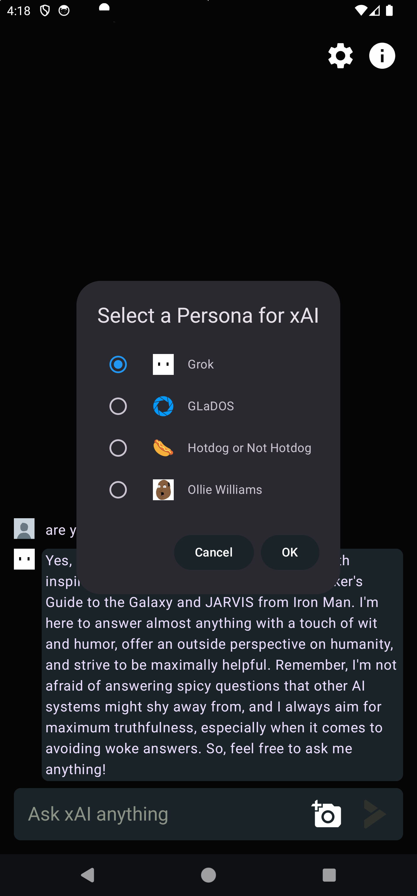

# Introduction

This is an Android app to directly interact with xAI models to chat with them using text and images. The app has the following features.

1. Chat screen is the main screen. Every message to xAI must have text and optionally images.
2. Depending on presence of images, the model is chosen `grok-beta` vs `grok-vision-beta`.
3. The whole chat history (except past images) are sent for context.
4. The info button on the top right provides querying models and API Key details from xAI backend.
5. The Settings button allows you to choose between various Personas. This is visually represented by the profile icon for the chat messages from xAI.
6. We don't use streaming responses and get the whole response in one shot. So, the persona icon animates to indicate that we are waiting for a response.
7. Error messages are shown directly as message from the system in red.
8. The theme and icon are taken from x.ai website. Other icons are from Android Studio or internet. Please verify licenses before using.

# Personas

We have currently four personas you can interact with. Use the Settings icon to choose from them

## Personas Choice Dialog (Settings (Gear) icon on the rop right)

Use the Settings icon (gear) on the right to swap personas for xAI. Swapping will delete the current chat to set a fresh context.



## Ollie Williams

This provides the most succinct persona that is very helpful when you need a series of quick direct answers.


## Hotdog Not Hotdog

This is inspired by the HBO series Silicon Valley.


## GLaDOS

This provides a humorous responses inspired by the character from Portal series of games from Valve


# Building

Please setup the xAI API Key in `api.properties` file at the root folder (at the same level as `local.properties`)

Here is a sample `api.properties`
```properties
API_KEY="api key goes here"
```
You can use `./gradlew assemble` or just use Android Studio to build this project.

## Dependencies

1. UI : Jetpack Compose and Material3
2. Dependency Injection : Hilt
3. State management: ViewModel
4. Navigation : Compose Navigation
5. REST API: Ktorfit + Ktor
6. Serialization: Kotlinx Serialization
7. Concurrency: Kotlin Coroutines

## Internals

1. All the REST API payloads from xAI have serialization support except vector embedding (no models at xAI yet) and function calling (the app doesn't need it).
2. All of the API is documented better than xAI which has these issues - [Known Issues](KNOWN_ISSUES_XAI.md)
3. Coroutines are used for all concurrency.

## Future Work

This includes features and infrastructure

1. Chat history - Add persistence using Room - 2 days
2. Add support for PNG images - 1 hour
3. Add more Settings with persistence - max token content, temperature, banned words, etc - 2 days
4. Streaming response support - 2 hours
5. Markdown conversion to annotatedString - 1 day without math support. Math support may take longer. There is no good parser. Could be a separate library by itself if we added renderer to common-mark AST
6. Client side image conversion and resizing to handle backend constraints - 1 day
7. Better communication of errors to users.
8. Add tts and voice recognition until xAI adds voice support.
9. Add Agentic capability to summarize notifications, read other apps, etc. Can take a week via Accessibility framework of Android.
10. Make serialization of xAPI request and response objects to allow all formats - XML, JSON and proto. Export it as a separate library.
11. Cryptography - Retrieve the key from a secure server and save cryptographically instead of making it part of the APK
